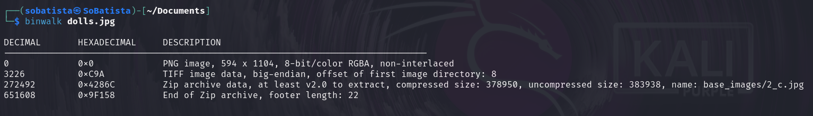
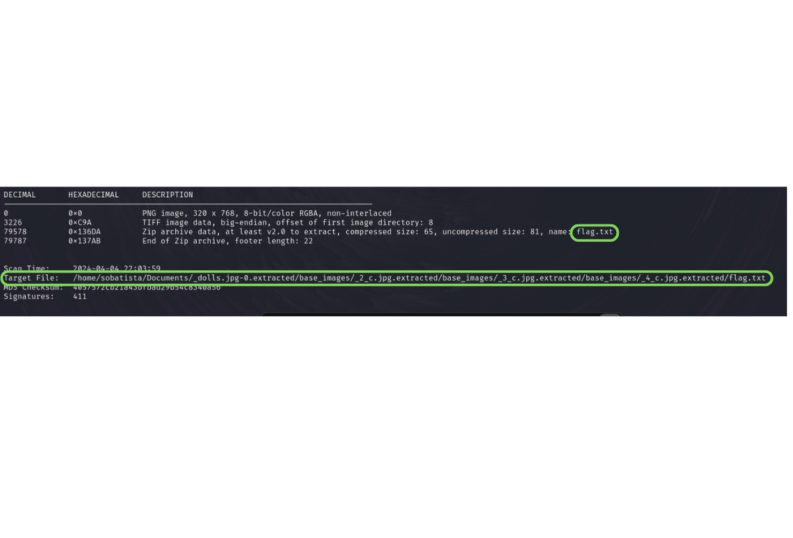
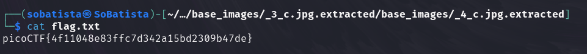

# Matryoshka Writeup

1. Used binwalk tool to see if there was any file embedded inside of dolls.jpg file (command used: binwalk dolls.jpg) -> see image 1
2. Then I saw that there was something hidden inside of dolls.jpg file and I used the following command to extract them: binwalk -Me dolls.jpg -> see image 2 to see the flag path to the flag.txt file.
3. The hidden files where downloaded to my machine and from the output of the command on step 2, I could see that the flag was hidden inside of the following path: /path_to_the/_dolls.jpg-0.extracted/base_images/_2_c.jpg.extracted/base_images/_3_c.jpg.extracted/base_images/_4_c.jpg.extracted -> see image 3

