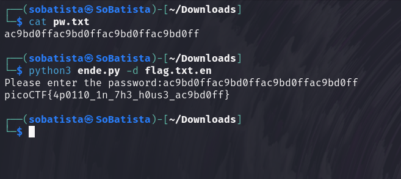

# Python Wrangling writeup

1. Read the lines 8 to 12 of the python code on 'ende.py'

2. Then read the file 'pw.txt' (this is the password)

3. There is no need to read the file 'flag.txt.en' since it is encrypted (the '.en' extension stands for encrypted)

4. Then use the example on line 12 of the 'ende.py' to decrypt the file 'flag.txt.en' using the password saved on 'pw.txt' file

