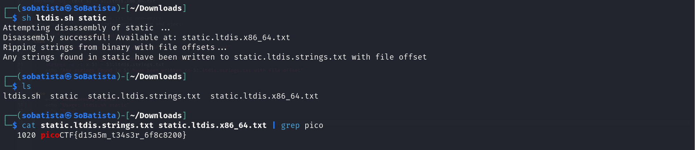

# Static ain't alwaysnoise Writeup

1. Download the files
2. See the content of the 'ltdis.sh' file
3. Run the 'ltdis.sh' and give the 'static' file as argument
4. Two files will be created and you can search for the flag using 'cat <the name of the files> | grep pico'

