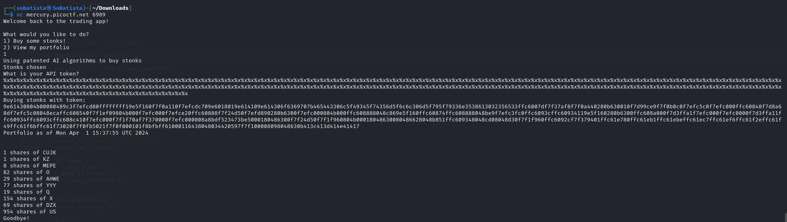
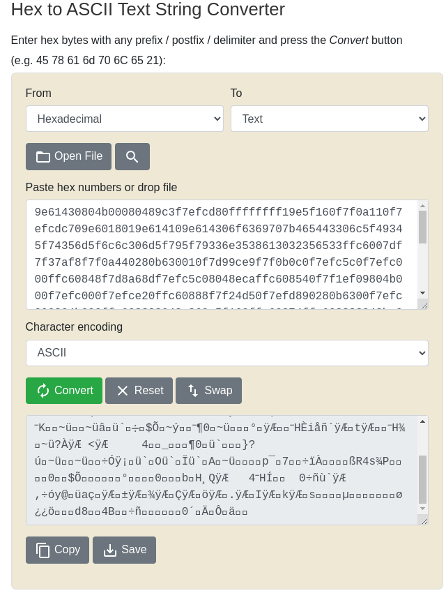
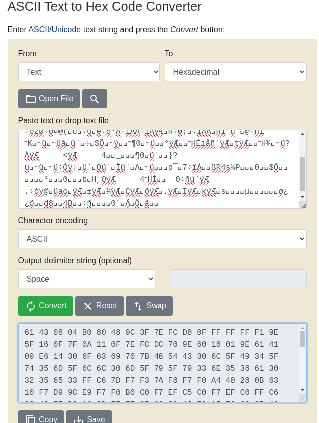
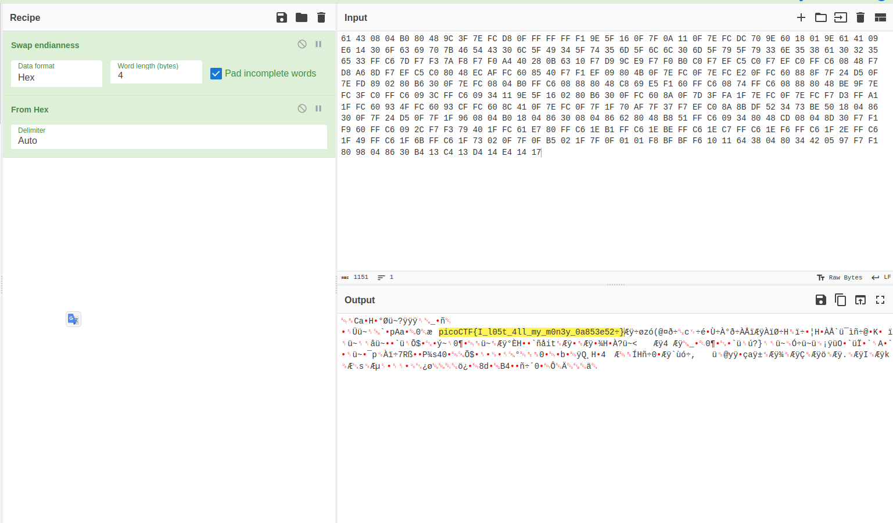

# Stonks writeup

1. Read the code on the file 'vuln.c'

2. Do nc mercury.picoctf.net 6989

3. Then insert the option number 1

4. Insert the Characters '%x' repeatedly

3. Then decrypt the output from hexadecimal to ASCII

4. Then copy the all the conversion and decrypt it from ASCII to Hexadecimal

5. Then Take that conversion and insert it on cyberchef with the following recipe:
    1. Swap endianness
    2. From Hexadecimal

